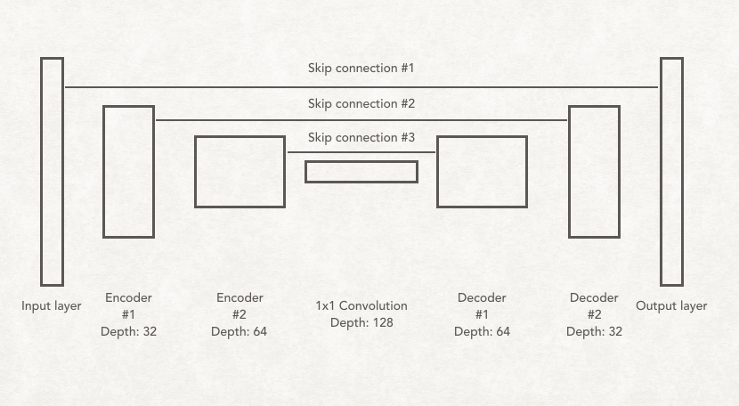
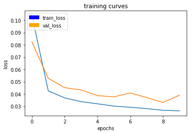
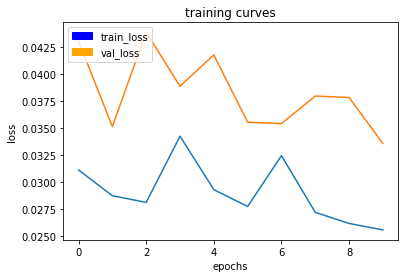
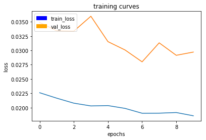
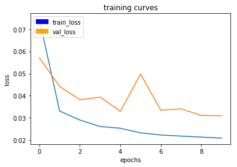
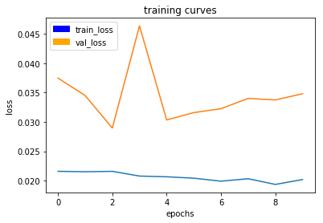
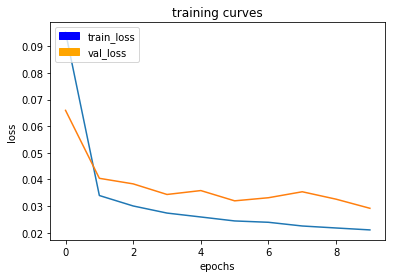

[](https://www.udacity.com/robotics)

## Deep Learning Project ##

In this project, we will train a deep neural network to identify and track a target in simulation. So-called “follow me” applications like this are key to many fields of robotics and the very same techniques we apply here could be extended to scenarios like advanced cruise control in autonomous vehicles or human-robot collaboration in industry.

[image_0]: ./docs/misc/sim_screenshot.png
![alt text][image_0] 

## Writeup

### Network Architecture

In this project, Fully Convolutional Networks (FCN) was used for semantic segmentation. It segment quadcopter images and classifed them into three categories: background, people and hero. this project is based the location of the detected hero to adjust the control command of the quadcopter and to follow her.



FCNs consists of components:
* **Encoders** - It is a series of convolution layers like VGG and ResNet. The goal of the encoder is to extract key features from input image. We can borrow techniques from transfer learning to accelerate the training of our FCNs. It’s common for the encoder to be pre-trained on ImageNet. VGG and ResNet are popular choices.

* **Decoders** - It up-scales the output of the encoder, such that it’s the same size as the original image. Thus, it results in segmentation or prediction of each individual pixel in the original image.

Beside, FCN also used three special techniques:

* **1x1 convolution** - It is 1x1 convolutional filter behaves exactly the same as “normal” filters. The filter pools the information across multi feature maps. The size of the kernel actually is 1x1xk where k is the number of feature maps. This is one way to compress these feature maps into one (or you can think of it as dimension reduction). If the values of the kernel are equal, the kernel is the average pooling. Comparing fully connected layer and 1x1 convolution, if we feed the output of a convolutional layer into a fully connected layer, we flatten it into a 2D tensor. This results in the loss of spatial information, because no information about the location of the pixels is preserved. We can avoid that by using 1x1 convolutions, i.e. the spatial information will be preserved with 1x1 convolutions.

* **Transposed Convolutions** - It is used for decoder. It helps in upsampling the previous layer to a desired resolution or dimension. Suppose you have a 3x3 input and you wish to upsample that to the desired dimension of 6x6. The process involves multiplying each pixel of your input with a kernel or filter. If this filter was of size 5x5, the output of this operation will be a weighted kernel of size 5x5. This weighted kernel then defines your output layer.

* **Skip connection** - If we were to decode the output of the encoder back to the original image size, some information has been lost. Skip connections are a way of retaining the information easily. The way skip connection work is by connecting the output of one layer to a non-adjacent layer.

**Batch Normalization**

Batch normalization is an additional way to optimize network training. Batch normalization is based on the idea that, instead of just normalizing the inputs to the network, we normalize the inputs to layers within the network. It's called "batch" normalization because during training, we normalize each layer's inputs by using the mean and variance of the values in the current mini-batch.

A network is a series of layers, where the output of one layer becomes the input to another. That means we can think of any layer in a neural network as the first layer of a smaller network.

The following snippet code, shown below, is used to define the FCN model:

``` python
def fcn_model(inputs, num_classes):
    
    # Add Encoder Blocks. 
    # Remember that with each encoder layer, the depth of your model (the number of filters) increases.
    encoder_l1 = encoder_block(input_layer=inputs, filters=32, strides=2)
    encoder_l2 = encoder_block(input_layer=encoder_l1, filters=64, strides=2)

    # Add 1x1 Convolution layer using conv2d_batchnorm().
    batch_normal_output = conv2d_batchnorm(input_layer=encoder_l2, filters=128, kernel_size=1, strides=1)
    
    # Add the same number of Decoder Blocks as the number of Encoder Blocks
    decoder_l1 = decoder_block(small_ip_layer=batch_normal_output, large_ip_layer=encoder_l1, filters=64)
    x = decoder_block(small_ip_layer=decoder_l1, large_ip_layer=inputs, filters=32)    
    
    # The function returns the output layer of your model. "x" is the final layer obtained from the last decoder_block()
    return layers.Conv2D(num_classes, 1, activation='softmax', padding='same')(x)
```

For more detailed implementation of the network, you may refer to [model_training.ipynb](https://github.com/samuelpfchoi/RoboND-P4-DeepLearning-Project/blob/master/code/model_training.ipynb)

### Training

My approach to choose the parameters is: increasing the value of batch_size and steps_per_epoach gradually per training cycle and after reaching certain level of accuracy, I tried to reduce the learning_rate in order to achieve further higher accuracy.

In additional to tuning parameter for accuracy, I also tried used no. of different value of **workers** parameter in order to speedup the training time. However, it seems no significant improvement thus I stick back to default value.


I totally carried out 6 trials with difference hyperparameters. The following table shows the results of the trials:


| Parameter         | Trial 1 | Trial 2 | Trial 3 | Trial 4 | Trial 5 | Trail 6 |
| ----------------- | ------- | ------- | ------- | ------- | ------- | -------
| learning rate     | 0.01    | 0.01    | 0.01    | 0.01    | 0.01    | 0.005   |
| batch size        | 64      | 32      | 128     | 128     | 128     | 128     |
| num epochs        | 10      | 10      | 10      | 10      | 10      | 10      |
| steps per epoch   | 300     | 300     | 300     | 500     | 100     | 500     |
| validation steps  | 50      | 50      | 50      | 50      | 50      | 50      |
| workers           | 2       | 2       | 2       | 2       | 5       | 2       |
| train loss        | 0.0263  | 0.0255  | 0.0186  | 0.0209  | 0.0203  | 0.0210  |
| validation loss   | 0.0391  | 0.0336  | 0.0297  | 0.0310  | 0.0348  | 0.0292  |
| final score       | 0.3722  | 0.4060  | 0.4364  | 0.4198  | 0.4198  | 0.4270  |


The following shown the training curves of each training:

**Trial 1** - [model_training_trial_01.ipynb](https://github.com/samuelpfchoi/RoboND-P4-DeepLearning-Project/blob/master/code/model_training_trial_01.ipynb)



300/300 [==============================] - 243s - loss: 0.0263 - val_loss: 0.0391

**Trial 2** - [model_training_trial_02.ipynb](https://github.com/samuelpfchoi/RoboND-P4-DeepLearning-Project/blob/master/code/model_training_trial_02.ipynb)



300/300 [==============================] - 106s - loss: 0.0255 - val_loss: 0.0336

**Trial 3** - [model_training_trial_03.ipynb](https://github.com/samuelpfchoi/RoboND-P4-DeepLearning-Project/blob/master/code/model_training_trial_03.ipynb)



300/300 [==============================] - 420s - loss: 0.0186 - val_loss: 0.0297

**Trial 4** - [model_training_trial_04.ipynb](https://github.com/samuelpfchoi/RoboND-P4-DeepLearning-Project/blob/master/code/model_training_trial_04.ipynb)



500/500 [==============================] - 699s - loss: 0.0209 - val_loss: 0.0310

**Trial 5** - [model_training_trial_05.ipynb](https://github.com/samuelpfchoi/RoboND-P4-DeepLearning-Project/blob/master/code/model_training_trial_05.ipynb)



100/100 [==============================] - 148s - loss: 0.0203 - val_loss: 0.0348

**Trial 6** - [model_training.ipynb](https://github.com/samuelpfchoi/RoboND-P4-DeepLearning-Project/blob/master/code/model_training.ipynb)



500/500 [==============================] - 691s - loss: 0.0210 - val_loss: 0.0292


After tested no. of combination of hyperparameters, I selected the set of parameters, shown in below, that can achieve the score above the required threshold, 0.4:

``` python
learning_rate = 0.005 
batch_size = 128
num_epochs = 10
steps_per_epoch = 500
validation_steps = 50
workers = 2
```

**Validation**

There are three set of validation dataset to evaluate how well the trained model is doing under different conditions:
1) **patrol_with_targ**: Test how well the network can detect the hero from a distance.
2) **patrol_non_targ**: Test how often the network makes a mistake and identifies the wrong person as the target.
3) **following_images**: Test how well the network can identify the target while following them.

Results of dataset (1):


Results of dataset (2):


Results of dataset (3):


**Scoring**

There are several different scroes to help evaluate the trained model. For my trained model, its final score is 0.427.

### Testing in Simulation

To run the simulation:
1. Launch the simulator, select "Spawn People", and then click the "Follow Me" button.
2. Run the realtime follower script

``` python
$ python follower.py --pred_viz model_weights.h5
```

**Result**

The following image links to the youtube video of the simulation result, you may click the image below to view

<p align="center">
    <a href="https://www.youtube.com/watch?v=FUz385ahS-U">
        
    </a>
</p>

**limitation**

This model was trained by the set of training data, hero & people, with human characteristics. If using this model to identify other object(dog, cat, car, etc), then we must provide the set of the corresponding training data to re-training the model.

**Improvement**
* When training this network, we need to gather a huge amount of training data to get enough accuracy. It is time consuming thus we could use augmented method to generate more training data based on exiting.
* Beside, tuning the hyperparameters manually is another big issue especially when the training required more one/two/more hour per cycle. by my understanding, if using adam optimizer to train the network, the learning rate was not need to tune manually. Or we could have a training program to adjust the parameter automatically based on trained result.
* Even though if we had a huge set of training data, we still need a very powerful machine or very long computation time to successfully train the network. Therefore, I think if anyway to reduce the requirement of the amount of training data. Recently, there is a completely new type of neural network based on so-called **capsules**. It incorporates relative relationships between objects and it is represented numerically as a 4D pose matrix. Maybe, we can applied some idea from capsules network to achieve more accuracy result with less training data.