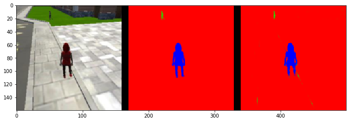

[](https://www.udacity.com/robotics)

## Deep Learning Project ##

In this project, we will train a deep neural network to identify and track a target in simulation. So-called “follow me” applications like this are key to many fields of robotics and the very same techniques we apply here could be extended to scenarios like advanced cruise control in autonomous vehicles or human-robot collaboration in industry.

[image_0]: ./docs/misc/sim_screenshot.png
![alt text][image_0] 

## Writeup

### Network Architecture

In this project, Fully Convolutional Networks (FCN) was used for semantic segmentation. It segment quadcopter images and classifed them into three categories: background, people and hero. this project is based the location of the detected hero to adjust the control command of the quadcopter and to follow her.

In general, FCNs consists of 3 parts:
* Encoders
* 1x1 convolution
* Decoders


The following snippet code, shown below, is used to define the FCN model:

``` python
def fcn_model(inputs, num_classes):
    
    # Add Encoder Blocks. 
    # Remember that with each encoder layer, the depth of your model (the number of filters) increases.
    encoder_l1 = encoder_block(input_layer=inputs, filters=32, strides=2)
    encoder_l2 = encoder_block(input_layer=encoder_l1, filters=64, strides=2)

    # Add 1x1 Convolution layer using conv2d_batchnorm().
    batch_normal_output = conv2d_batchnorm(input_layer=encoder_l2, filters=128, kernel_size=1, strides=1)
    
    # Add the same number of Decoder Blocks as the number of Encoder Blocks
    decoder_l1 = decoder_block(small_ip_layer=batch_normal_output, large_ip_layer=encoder_l1, filters=64)
    x = decoder_block(small_ip_layer=decoder_l1, large_ip_layer=inputs, filters=32)    
    
    # The function returns the output layer of your model. "x" is the final layer obtained from the last decoder_block()
    return layers.Conv2D(num_classes, 1, activation='softmax', padding='same')(x)
```

### Training, Validation and Scoring

**Hyperparameters**

Generally, my approach to selecting the parameters is: increasing the value of batch_size and steps_per_epoach gradually per training cycle and after reaching certain level of accuracy, I tried to reduce the learning_rate in order to acheive further higher accuracy.

After tested no. of combination of hyperparameters, I selected the set of parameters, shown in below, that can acheive the score above the required threshold, 0.4:

``` python
learning_rate = 0.005 
batch_size = 128
num_epochs = 10
steps_per_epoch = 500
validation_steps = 50
workers = 2
```

In additional to tunning parameter for accurary, I also tried used no. of different value of *workers" parameter in order to speedup the training time. However, it seems no significant improvement thus I stick back to default value.

**Validation**

There are three set of validation dataset to evaluate how well the trained model is doing under different conditions:
1) **patrol_with_targ**: Test how well the network can detect the hero from a distance.
2) **patrol_non_targ**: Test how often the network makes a mistake and identifies the wrong person as the target.
3) **following_images**: Test how well the network can identify the target while following them.

Results of dataset (1):




Results of dataset (2):


Results of dataset (3):


**Scoring**

There are several different scroes to help evaluate the trained model. For my trained model, its final score is 0.427.

### Testing in Simulation

To run the simulation:
1. Launch the simulator, select "Spawn People", and then click the "Follow Me" button.
2. Run the realtime follower script

``` python
$ python follower.py --pred_viz model_weights.h5
```

**Result**

The following image links to the youtube video of the simulation result, you may click the image below to view

<p align="center">
    <a href="https://www.youtube.com/watch?v=FUz385ahS-U">
        
    </a>
</p>

**Improvement**
Recently, there is a completely new type of neural network based on so-called **capsules**. It incorporates relative relationships between objects and it is represented numerically as a 4D pose matri. Maybe, we can applied some idea from capsules network to archieve more accuracy result with less training data.